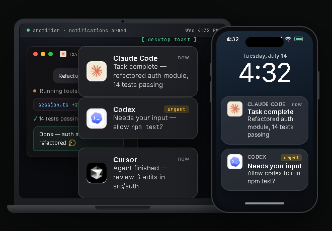

<h1 align="center">anotifier</h1>

<p align="center">
  <strong>Desktop & phone notifications for AI coding agents</strong><br />
  One tool. One config. Every agent. Never miss when your AI finishes or needs input.
</p>

<p align="center">
  &nbsp;&nbsp;
  &nbsp;&nbsp;
  &nbsp;&nbsp;
  &nbsp;&nbsp;
  
</p>

<p align="center">
  <a href="https://anotifier.io"><strong>anotifier.io</strong></a>
</p>

<p align="center">
  <a href="https://anotifier.io"></a>
  <a href="https://www.npmjs.com/package/anotifier"></a>
  <a href="https://www.npmjs.com/package/anotifier"></a>
  <a href="https://github.com/DevinoSolutions/anotifier-for-claude-codex-cursor/actions/workflows/unit.yml"></a>
  <a href="https://github.com/DevinoSolutions/anotifier-for-claude-codex-cursor/blob/main/LICENSE"></a>
  <a href="https://nodejs.org">= 18" /></a>
  
</p>

<p align="center">
  
  
  
  
  
</p>

<p align="center">
  
</p>

---

## Demo

https://github.com/user-attachments/assets/5714b528-7e04-478e-abfd-2a3d05db562c

[Watch with sound on YouTube](https://www.youtube.com/watch?v=QVVOIIud4-I)

## Quick Start

```bash
npx anotifier@latest setup
```

That's it. The setup wizard detects your platform and installed AI tools, wires the hooks, and optionally configures phone push notifications. Restart your AI tools to activate.

## Features

- **Desktop toast notifications** -- Windows (BurntToast), macOS (Notification Center), Linux (libnotify)
- **WSL toast routing** -- toasts from inside WSL are routed to Windows over PowerShell interop instead of a Linux notification daemon (see the proof boundary below)
- **Phone push notifications** -- Android & iOS via [ntfy](https://ntfy.sh) (free, no account required)
- **Webhook notifications** -- Slack, Discord, Telegram, or any HTTP endpoint, with an optional auth header
- **Rich notification content** -- Claude Code toasts and webhooks show what the agent actually said or asked, not a generic line
- **Terminal bell** -- audible ding in the terminal that launched the agent (works over SSH/tmux)
- **Click-to-focus** -- click the toast to jump back to the terminal or VS Code window (Windows)
- **Codex approval alerts** -- get notified the instant Codex asks for permission, not just when it finishes
- **Per-tool branded icons** -- each tool gets its own logo in the notification
- **One unified config** -- shared `~/.anotifier/config.json` across all tools
- **Atomic deduplication** -- prevents double notifications (e.g. Cursor's duplicate hook fires)
- **Zero dependencies** -- pure Node.js built-ins only, no npm production packages

## Supported Tools

<table>
  <tr>
    <th>Tool</th>
    <th>VS Code</th>
    <th>CLI</th>
    <th>Task Complete</th>
    <th>Needs Input</th>
  </tr>
  <tr>
    <td>&nbsp; <strong>Claude Code</strong></td>
    <td align="center">Native</td>
    <td align="center">Native</td>
    <td><code>Stop</code></td>
    <td><code>Notification</code></td>
  </tr>
  <tr>
    <td>&nbsp; <strong>Codex CLI</strong></td>
    <td align="center">Native</td>
    <td align="center">Native</td>
    <td><code>Stop</code></td>
    <td><code>PermissionRequest</code></td>
  </tr>
  <tr>
    <td>&nbsp; <strong>Cursor</strong></td>
    <td align="center">Native</td>
    <td align="center">--</td>
    <td><code>stop</code></td>
    <td>--</td>
  </tr>
  <tr>
    <td>&nbsp; <strong>Gemini CLI</strong></td>
    <td align="center">--</td>
    <td align="center">Native</td>
    <td><code>AfterAgent</code></td>
    <td><code>Notification</code></td>
  </tr>
</table>

All four tools are wired automatically by the setup wizard. No manual config editing needed. Codex's `PermissionRequest` hook fires the same "needs your input" alert when Codex asks for approval to run a command -- verified with Codex CLI >=0.144.0.

### VS Code Native Support

Claude Code, Codex, and Cursor all run inside VS Code. **anotifier** hooks directly into each tool's native hook system -- no VS Code extension required. The setup wizard detects installed tools and patches their configs automatically. Click a notification toast to jump straight back to your VS Code window.

## Installation

### npm (recommended)

```bash
# One-shot setup (no install needed)
npx anotifier@latest setup

# Or install globally
npm i -g anotifier
anotifier setup
```

### Claude Code Plugin

Add the marketplace, then install the plugin from it:

```
/plugin marketplace add DevinoSolutions/anotifier-for-claude-codex-cursor
/plugin install anotifier@anotifier
```

Hooks auto-register. Use `/anotifier:setup` to wire other tools.

### Standalone (no npm)

**Windows (PowerShell):**
```powershell
irm https://raw.githubusercontent.com/DevinoSolutions/anotifier-for-claude-codex-cursor/main/setup/install.ps1 | iex
```

**macOS / Linux:**
```bash
curl -fsSL https://raw.githubusercontent.com/DevinoSolutions/anotifier-for-claude-codex-cursor/main/setup/install.sh | bash
```

## CLI Commands

```
anotifier setup            # First-time setup wizard
anotifier status           # Show wired tools, config, backends
anotifier test [channel]   # Fire test notification (toast | ntfy | webhook | bell | both)
anotifier config [section] # Interactive settings (ntfy | webhook | sounds | events | sentry)
anotifier doctor [--deep]  # Diagnose delivery per channel (--deep verifies real delivery)
anotifier snooze [dur]     # Silence every channel for a while (30m | 2h | 90s | 45 = 45 minutes)
anotifier snooze off       # Cancel the snooze early
anotifier uninstall        # Remove hooks from all tools
```

`anotifier snooze` with no argument prints the current state (`Snoozed until 14:32` or `Not snoozed`); `anotifier status` shows the same thing. A snooze silences **every** channel -- toast, ntfy, webhook and the terminal bell -- until it expires on its own, and it survives across sessions because the deadline is stored in `~/.anotifier/.snooze.json`.

## Configuration

Config lives at `~/.anotifier/config.json`. Abbreviated — see [config/default-config.json](config/default-config.json) for every key and default:

```json
{
  "ntfy": {
    "enabled": true,
    "server": "https://ntfy.sh",
    "topic": "anotifier-<random>",
    "click": ""
  },
  "toast": {
    "enabled": true,
    "clickToFocus": true
  },
  "terminalBell": {
    "enabled": true
  },
  "webhook": {
    "enabled": false,
    "url": "",
    "format": "generic"
  },
  "sentry": {
    "enabled": false,
    "dsn": ""
  },
  "updateCheck": {
    "enabled": true
  },
  "quietHours": {
    "enabled": false,
    "from": "22:00",
    "to": "08:00"
  },
  "events": {
    "task_complete": { "toastSound": "IM", "priority": "default" },
    "needs_input": { "toastSound": "Reminder", "priority": "urgent" },
    "session_start": {
      "toastSound": "Default",
      "priority": "low",
      "toastEnabled": false,
      "ntfyEnabled": false,
      "terminalBellEnabled": false
    }
  }
}
```

`ntfy.click` is the URL opened when you tap a phone notification (empty = no link). `terminalBell` rings the terminal that launched the agent -- for Claude Code (>=2.1.141) it rings through Claude Code's own terminal write path (hook JSON `terminalSequence`), which is safe in tmux, GNU screen, and on Windows per Claude Code's docs; other agents get a direct TTY/console bell. `webhook` posts to Slack, Discord, Telegram, or any URL (see below). `sentry` is opt-in error reporting (see [Error visibility](#error-visibility)). `updateCheck` announces a newly published anotifier through whichever of your toast / ntfy / webhook channels are already on (never the terminal bell) -- it asks the npm registry at most once per day, tells you at most once per version, and stays silent on any error; set `enabled` to `false` to turn it off entirely, and no check or state write happens at all. `quietHours` is a recurring nightly version of `snooze` (see [Quiet hours](#quiet-hours)). Per-event `toastSound` names a Windows [BurntToast](https://github.com/Windos/BurntToast) sound; on macOS the name is mapped to the closest built-in system sound (Windows names like `IM`/`Reminder` are translated, and `Default` or unrecognized names fall back to the system default), while on Linux it is ignored; `priority` (`min` / `low` / `default` / `high` / `urgent`) drives both the ntfy push priority and the Linux `notify-send` urgency.

### Quiet hours

Off by default. Set `quietHours.enabled` to `true` and every channel goes silent inside the window, every day:

```json
{
  "quietHours": {
    "enabled": true,
    "from": "22:00",
    "to": "08:00"
  }
}
```

- Times are `"HH:MM"` on a 24-hour clock, in your machine's **local** time.
- The start is inclusive and the end is exclusive: `22:00` is silenced, `08:00` is not.
- Windows may span midnight. `22:00` -> `08:00` covers 22:00-23:59 **and** 00:00-07:59. A same-day window like `08:00` -> `22:00` works the same way.
- `from` equal to `to` is a zero-length window and turns the feature **off**, rather than silencing you for a full 24 hours.
- A time that isn't a valid `HH:MM` disables the whole block instead of falling back to the default window -- a typo should never silence you -- and the problem is reported by `anotifier status`.

`anotifier status` shows the window and whether you are currently inside it.

**How quiet hours and `snooze` interact:** they are independent, and either one alone silences the run -- there is no per-channel scoping, it is all channels or none. A silenced run is silenced completely: no toast, no ntfy push, no webhook POST, no terminal bell, and no update notice either. What does *not* change is the hook contract -- the hook still exits successfully and still returns the response its agent expects, so silencing notifications can never stall or break Claude Code, Codex, Cursor or Gemini CLI. The daily update check simply runs on the next un-silenced run.

### ntfy -- Phone Push Notifications

[ntfy](https://ntfy.sh) sends free push notifications to your phone -- no account needed.

1. Install the ntfy app ([Android](https://play.google.com/store/apps/details?id=io.heckel.ntfy) / [iOS](https://apps.apple.com/app/ntfy/id1625396347))
2. Subscribe to your topic (shown during setup)
3. All your AI tools' notifications appear in one stream

### Webhook -- Slack, Discord, Telegram, or anything

Set `webhook.enabled: true` and a `webhook.url` to POST a notification to any HTTP endpoint. `format` selects the payload shape:

**Slack:**
```json
{
  "webhook": {
    "enabled": true,
    "url": "https://hooks.slack.com/services/...",
    "format": "slack"
  }
}
```

**Discord:**
```json
{
  "webhook": {
    "enabled": true,
    "url": "https://discord.com/api/webhooks/...",
    "format": "discord"
  }
}
```

**Telegram:**
```json
{
  "webhook": {
    "enabled": true,
    "url": "https://api.telegram.org/bot<token>/sendMessage",
    "format": "telegram",
    "chatId": "123456789"
  }
}
```

**Generic (anything else):**
```json
{
  "webhook": {
    "enabled": true,
    "url": "https://example.com/hook",
    "format": "generic",
    "authorization": "Bearer <token>"
  }
}
```
Generic POSTs `{title, message, source, project, event, timestamp}` as JSON. `authorization`, if set, is sent as the `Authorization` header for any format, not just generic.

Webhook failures are logged with the URL's origin only, never the full URL -- a Slack/Discord webhook URL or a Telegram bot token is a secret, and errors.log can be mirrored to Sentry.

Test it with `anotifier test webhook`, or turn it off for one event type with `"events": {"task_complete": {"webhookEnabled": false}}`.

### Rich notification content

For Claude Code, toast and webhook notifications show what actually happened instead of a generic "task complete" line: a "needs input" notification carries Claude's own question, and a "task complete" notification carries the last assistant message, both read from the Claude Code transcript and trimmed to a short snippet. Session-start notifications stay generic (nothing to show yet). Other agents (Codex, Cursor, Gemini) always get the generic text -- transcript reading is Claude Code-only.

Controlled per channel:

| Channel | Config key | Default |
|---------|-----------|:-------:|
| Toast | `toast.richContent` | `true` |
| Webhook | `webhook.richContent` | `true` |
| ntfy | `ntfy.richContent` | `false` |

`ntfy.richContent` defaults to **false** for privacy: the default `ntfy.sh` server is public, ntfy topic names are guessable rather than access-controlled secrets, and a snippet of your conversation would leak to anyone who guesses or stumbles on your topic. Only enable `ntfy.richContent` if you run your own private ntfy server, or you've deliberately accepted that risk on the public one.

### Per-Event Settings

| Event | Default `toastSound` | Default `priority` | Description |
|-------|:------------:|:-------------:|-------------|
| `task_complete` | IM | default | Agent finished its task |
| `needs_input` | Reminder | urgent | Agent needs your input or permission |
| `session_start` | Default | low | New session started (all channels off by default) |

**Claude's idle reminder is quieter than a real prompt.** About a minute after a turn ends, Claude Code sends a second notification along the lines of *"Claude is waiting for your input"*. Nothing is blocked -- the work is done -- so anotifier delivers that one at `default` priority with a calm tag instead of the urgent `needs_input` treatment. A genuine permission prompt is untouched and still arrives urgent. The reminder is never suppressed, only turned down, and if Claude ever changes that wording the reminder simply goes back to being urgent -- it can never go silent. To pick your own level for it, set `idleReminderPriority` on the event:

```json
{
  "events": {
    "needs_input": { "idleReminderPriority": "low" }
  }
}
```

It takes the same `min` / `low` / `default` / `high` / `urgent` scale as `priority`, and applies only to the idle reminder.

### Error visibility

Hook and channel errors never interrupt your agent -- they're appended to `~/.anotifier/errors.log` and surfaced by `npx anotifier status`, so a misconfigured toast backend or unreachable ntfy topic shows up as a logged error instead of a silent no-op. Set `sentry.enabled` to `true` (with a `sentry.dsn`) to also mirror those errors to [Sentry](https://sentry.io) through a built-in, zero-dependency envelope client: no SDK is bundled, no telemetry is collected, and nothing leaves your machine unless you opt in -- only error data is sent.

## How It Works

Each AI tool's hook system pipes event data to `notify.mjs`:

```
Hook fires (stdin JSON + --source flag)
  -> parse-input.mjs   (normalize across tools)
  -> router.mjs        (map event to notification type)
  -> transcript.mjs    (Claude Code only: derive rich message text)
  -> platform toast    (Windows / macOS / Linux / WSL)
  -> ntfy push         (phone notification)
  -> webhook POST      (Slack / Discord / Telegram / generic)
  -> terminal bell     (Claude Code: terminalSequence in the hook reply;
                        other tools: BEL to the controlling terminal)
```

## Platform Details

### Windows

- [BurntToast](https://github.com/Windos/BurntToast) PowerShell module for rich toast notifications
- Click-to-focus via custom `agentfocus://` URI protocol
- BurntToast auto-installed during setup if missing
- Requires PowerShell 7+ (pwsh)

### macOS

- Uses built-in `osascript` -- zero additional dependencies

### Linux

- Uses `notify-send` (libnotify) -- available on most desktop distributions
- Fails silently on headless systems without a GUI (see WSL below for WSL2)

### WSL

- Auto-detected -- no config needed
- Toast notifications are routed to Windows via PowerShell interop (`powershell.exe`/`pwsh.exe` across the `/mnt/c` boundary) instead of `notify-send`/D-Bus, so no Linux notification daemon is needed
- Needs WSL2 interop enabled and a Windows PowerShell present -- both are on by default
- Terminal bell and ntfy behave exactly as on native Linux
- **Proof boundary:** WSL detection and the interop invocation are unit-tested (`tests/platforms-wsl.test.mjs`), but — unlike the native Linux/macOS/Windows toast lanes — no hosted CI runner proves a toast reaches the Windows host end to end, so this path is not claimed in the Testing table below

## Requirements

| Requirement | Details |
|-------------|---------|
| **Node.js** | >= 18.0.0 (already present for all supported AI tools) |
| **Windows** | PowerShell 7+ (pwsh) |
| **macOS** | osascript (built-in) |
| **Linux** | notify-send (optional, for desktop toasts) |

## Uninstall

```bash
anotifier uninstall
```

Removes all managed hooks from every tool's config. Original configs are backed up at `~/.anotifier/backups/`.

## Testing

Everything below is verified against the **real thing** — no mocks, no stubs, no fakes. Real ntfy.sh push delivery, a real Linux notification daemon receiving the exact payload, the real agent CLIs installed from npm and driven end to end, and the real native OS toast backends firing — then **read back out of the OS's own notification store** (`dunst` on Linux, Notification Center's database on macOS, `wpndatabase.db` on Windows) to prove the payload actually landed, not just that the call returned 0. Every job is **required** and **hard-fails**: a broken key, a renamed secret, or a hook that doesn't deliver turns CI red instead of skipping silently.

### What CI verifies on every run — all real, all platforms

Each job runs as its own GitHub Actions workflow. The badge in every row is its **live status on `main`** — not a screenshot — so click any badge to see the actual run and its per-test logs.

<table>
  <thead>
    <tr>
      <th>Job</th>
      <th align="center" width="180">Live status</th>
      <th>Platforms</th>
      <th>What is actually exercised (no mocks)</th>
    </tr>
  </thead>
  <tbody>
    <tr>
      <td><strong>Unit</strong></td>
      <td align="center"><a href="https://github.com/DevinoSolutions/anotifier-for-claude-codex-cursor/actions/workflows/unit.yml"></a></td>
      <td>Linux · macOS · Windows</td>
      <td>The full unit + integration suite against the real exported code (not inline copies)</td>
    </tr>
    <tr>
      <td><strong>E2E real-world</strong></td>
      <td align="center"><a href="https://github.com/DevinoSolutions/anotifier-for-claude-codex-cursor/actions/workflows/e2e.yml"></a></td>
      <td>Linux · macOS · Windows</td>
      <td>Real <code>setup</code>/<code>uninstall</code> subprocesses against an isolated HOME · real <code>notify.mjs</code> hook invocation per source · <strong>real ntfy.sh round-trip</strong> (push sent, then read back off the server)</td>
    </tr>
    <tr>
      <td><strong>Install + smoke-load</strong></td>
      <td align="center"><a href="https://github.com/DevinoSolutions/anotifier-for-claude-codex-cursor/actions/workflows/agents.yml"></a></td>
      <td>Linux · macOS · Windows</td>
      <td>Installs the <strong>real</strong> Claude, Codex, Gemini (and Cursor where available) CLIs from npm, asserts they launch, and smoke-loads each hook (Codex classification pinned — drift fails CI)</td>
    </tr>
    <tr>
      <td><strong>Live Claude</strong></td>
      <td align="center"><a href="https://github.com/DevinoSolutions/anotifier-for-claude-codex-cursor/actions/workflows/live-claude.yml"></a></td>
      <td>Linux · macOS</td>
      <td>Drives the <strong>real</strong> Claude CLI end to end (paid); <strong>hard-fails</strong> if the Stop hook doesn't deliver a real ntfy push · on macOS it also does a <strong>best-effort</strong> Notification Center read-back (logged, non-blocking — the hard osascript→NC delivery proof is the dedicated Toast macOS lane)</td>
    </tr>
    <tr>
      <td><strong>Live Gemini</strong></td>
      <td align="center"><a href="https://github.com/DevinoSolutions/anotifier-for-claude-codex-cursor/actions/workflows/live-gemini.yml"></a></td>
      <td>Linux · macOS</td>
      <td>Drives the <strong>real</strong> Gemini CLI end to end; <strong>hard-fails</strong> if the hook doesn't deliver a real ntfy push · on macOS it also does a <strong>best-effort</strong> Notification Center read-back (logged, non-blocking — the hard NC delivery proof is the dedicated Toast macOS lane)</td>
    </tr>
    <tr>
      <td><strong>Live Codex</strong></td>
      <td align="center"><a href="https://github.com/DevinoSolutions/anotifier-for-claude-codex-cursor/actions/workflows/live-codex.yml"></a></td>
      <td>Linux · macOS</td>
      <td>Validates <code>OPENAI_API_KEY</code> against the <strong>live OpenAI API</strong>, boots the real Codex config + PermissionRequest hook wiring, and drives a <strong>real completed <code>codex exec</code> turn</strong> (asserts it echoes a unique token) ¹</td>
    </tr>
    <tr>
      <td><strong>Live Cursor</strong></td>
      <td align="center"><a href="https://github.com/DevinoSolutions/anotifier-for-claude-codex-cursor/actions/workflows/live-cursor.yml"></a></td>
      <td>Linux</td>
      <td>Validates the real Cursor config-patch wiring (BYO key) ¹</td>
    </tr>
    <tr>
      <td><strong>TUI Proofs</strong></td>
      <td align="center"><a href="https://github.com/DevinoSolutions/anotifier-for-claude-codex-cursor/actions/workflows/tui-proofs.yml"></a></td>
      <td>macOS</td>
      <td>Drives the <strong>real</strong> Claude and Codex TUIs in a live <code>tmux</code> session. <strong>F1</strong>: the Claude terminal <strong>bell</strong> sets tmux's <code>window_bell_flag</code>. <strong>F2</strong>: a <strong>real Codex approval modal</strong> appears, our PermissionRequest notification fires, we approve via send-keys, and the guarded command runs — the full approval decision loop that <code>codex exec</code> structurally can't exercise</td>
    </tr>
    <tr>
      <td><strong>Live Toast Linux</strong></td>
      <td align="center"><a href="https://github.com/DevinoSolutions/anotifier-for-claude-codex-cursor/actions/workflows/toast-linux.yml"></a></td>
      <td>Linux</td>
      <td>Fires through the real <code>notify-send</code> backend into a <strong>real <code>dunst</code> daemon</strong>, then reads its history and asserts it captured the exact title + body — and goes one layer further, proving the notification is <strong>rendered on-screen</strong>: it captures the X display and reads the banner's text back with OCR (nonce present in a during-display frame, absent from the pre-fire frame) ²</td>
    </tr>
    <tr>
      <td><strong>Live Toast macOS</strong><br/>(delivery capture)</td>
      <td align="center"><a href="https://github.com/DevinoSolutions/anotifier-for-claude-codex-cursor/actions/workflows/toast-macos.yml"></a></td>
      <td>macOS</td>
      <td>Fires the <strong>real</strong> <code>osascript</code> backend, then <strong>reads the delivery back out of Notification Center's own SQLite DB</strong> and asserts the exact payload was recorded — so it fails when a real user would have seen nothing (the silent-drop an exit-code check misses). Also runs <code>anotifier doctor --deep</code> as an independent second check</td>
    </tr>
    <tr>
      <td><strong>Live Toast Native</strong></td>
      <td align="center"><a href="https://github.com/DevinoSolutions/anotifier-for-claude-codex-cursor/actions/workflows/toast-native.yml"></a></td>
      <td>Windows</td>
      <td>Fires the <strong>real</strong> BurntToast backend, then <strong>reads the notification back out of the Windows notification platform's own store</strong> (<code>wpndatabase.db</code>) and asserts the exact nonce was recorded in the toast's title <strong>and</strong> body — so it fails when a real user would have seen nothing (the silent-drop an exit-code check misses) ³</td>
    </tr>
  </tbody>
</table>

¹ The Live Codex lane completes a real `codex exec` turn, but non-interactive exec structurally can't exercise the **approval decision loop** — with no TTY, codex forces `approval: never` + a read-only sandbox, so the PermissionRequest hook never fires. That loop is proven end to end by the **TUI Proofs** lane (F2), which drives the interactive TUI. Cursor is a GUI editor (BYO key), so its lane validates the live key + real config wiring; its hook **delivery** is fully covered by the unit + e2e suites.

² The on-screen render proof draws the banner with **our** tuned `dunstrc` (large mono font, high contrast) on a **virtual** X display (Xvfb), so it proves the product path renders legible, machine-readable pixels — not that every user's desktop theme renders identically. macOS has no equivalent lane: on the hosted runner a real notification records in Notification Center but never presents a banner, and the accessibility/screen-capture routes are walled off by TCC, so **layer 2 (recorded in Notification Center) is the honest macOS CI ceiling** — on-screen rendering there is a real-machine concern (`npm run toast:demo`), while `anotifier doctor --deep` verifies real **delivery** on your own machine by reading that same Notification Center database back. See [`docs/research/2026-07-15-layer3-render-proof.md`](docs/research/2026-07-15-layer3-render-proof.md).

³ Like macOS, Windows is proven to **layer 2** in CI: the hosted `windows-latest` runner is a headless Session-0 environment with no interactive desktop, so the toast is **recorded** by the Windows notification platform but no banner is presented on a screen. The gate reads the record back out of `wpndatabase.db` (WAL-aware — a freshly fired toast lives in the DB's write-ahead log, so an `immutable=1` open would miss it and falsely report absence) and asserts the exact nonce in the title and body. On-screen rendering is a real-machine concern; for it `anotifier doctor` runs a **static backend check** (PowerShell + BurntToast + execution-policy state) — Windows has no delivery-record read-back in `--deep`, unlike macOS (Notification Center DB) and Linux (`dunst` history). See [`docs/research/2026-07-15-layer3-render-proof.md`](docs/research/2026-07-15-layer3-render-proof.md).

**WSL** has no row above on purpose. WSL toast routing (PowerShell interop across the `/mnt/c` boundary) is unit-tested for detection and interop invocation (`tests/platforms-wsl.test.mjs`, fully deps-injected), but a hosted CI runner cannot host both a WSL guest and an interactive Windows desktop to prove a toast crosses the boundary and lands — so, matching how the Codex `exec` lane doesn't claim the approval-decision loop (¹), that end-to-end delivery is deliberately **not** asserted here.

### Run it yourself

```bash
npm test            # offline: the full unit + integration suite
npm run test:e2e    # real ntfy.sh round-trip, needs network
npm run toast:demo  # fire real desktop toasts, every event
```

### The one thing CI can't prove

CI goes further than "the call returned 0." On **Linux** it reads the payload back out of a real `dunst` daemon **and** captures the X display to OCR the banner's text off the screen — pixels, not just a database row. On **macOS** it reads the delivery back out of Notification Center's own database, and on **Windows** out of the notification platform's `wpndatabase.db` — so a notification that was silently dropped for lack of permission records nothing and turns CI **red** instead of green. What no headless runner can prove is the last millimetre: a human's eyes actually seeing the banner. On macOS and Windows the on-screen banner can't be captured in CI at all (the hosted runner records the notification but never presents it — layer 2 is the ceiling ² ³), and everywhere Do Not Disturb / Focus can suppress the on-screen banner while the notification is still recorded as delivered. So "reached the notification store" is not always "a person saw it." To confirm with your own eyes — and to check your own machine's notification setup — run `npm run toast:demo` and `anotifier doctor --deep`. `--deep` fires a real test notification and reads it back where the OS allows: on **macOS** from Notification Center's database, on **Linux** from the `dunst` daemon's history (where `dunstctl` is present; other daemons honestly report dispatched-but-unverified). On **Windows**, `anotifier doctor` runs a static backend check (PowerShell + BurntToast + execution-policy).

## Contributing

Contributions are welcome. Please open an issue first to discuss what you'd like to change — see [CONTRIBUTING.md](CONTRIBUTING.md).

## Changelog

Release history is in [CHANGELOG.md](CHANGELOG.md).

## License

[AGPL-3.0](LICENSE) -- Copyright (c) 2026 [DevinoSolutions](https://github.com/DevinoSolutions)
